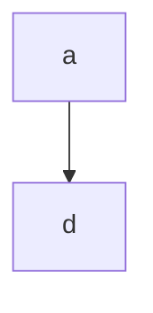
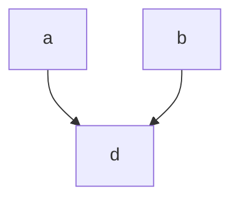
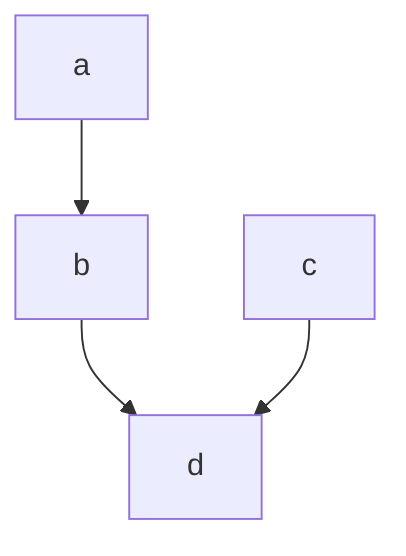
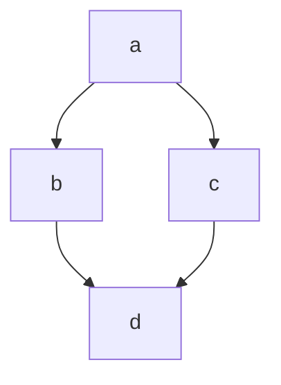
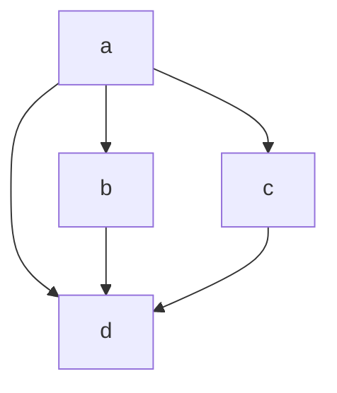

# @crikey/stores-base

Types and functions for creating [Svelte](https://svelte.dev/) compatible stores.
`@crikey/stores-base` stores further extend the [svelte/store](https://svelte.dev/docs#run-time-svelte-store)
contract to allow for additional features and extensibility.

See [@crikey/stores-base](https://whenderson.github.io/stores-mono/modules/_crikey_stores_base.html) for full documentation.

[](https://codecov.io/gh/WHenderson/stores-mono)

## API

### Store creation functions:
* `constant` - Create a `Readable` store with a fixed constant value
* `readable` - Create a `Readable` store
* `writable` - Create a `Writable` store
* `derive`   - Create a `Readable` store derived from the resolved values of other stores
* `transform`- Create a `Writable` store by applying transform functions when reading and writing values

### Utility functions:
* `get` - Retrieve the value of a store
* `read_only` - Restrict a store to the `Readable` interface

### Type guards:
* `is_writable` - Type guard to determine if store is `Writable`
* `is_readable` - Type guard to determine if store is `Readable`

### Trigger functions:
* `trigger_always` - Trigger at every available opportunity
* `trigger_strict_not_equal` - Trigger based on strict inequality
* `trigger_safe_not_equal` - Svelte compatible trigger - Trigger when not equal or value is complex

## Installation

```bash
# pnpm
$ pnpm add @crikey/stores-base

# npm
$ npm add @crikey/stores-base

# yarn
$ yarn add @crikey/stores-base
```

## Usage

This package is predominantly intended for internal use.

See individual APIs for strict usage instructions or browse the unit tests and usage from other packages in the mono repository.

## Differences with Svelte stores

### Definable trigger semantics
Svelte stores use a greedy change detection system to, whereby complex types are always considered to have changed.

e.g.
```ts
import { writable } from 'svelte/store';

const value = {};
const store = writable(value);
store.subscribe(value => console.log('changed'));
store.set(value);

// > changed
// > changed
```

`@crikey/stores-base` stores allow for user defined trigger functions. This trigger function is
called for each `Writable.set` and `Writable.update` call, allowing for user defined
comparisons between the old value and the new value to determine if subscribers should be notified.

e.g.

```ts
import {writable, trigger_strict_not_equal } from '@crikey/stores-base';

const value = {};
const store = writable(trigger_strict_not_equal, value); // only trigger if old_value !== new_value
store.subscribe(value => console.log('changed'));
store.set(value);

// > changed
```

### Asynchronous `update` as well as `set`

@crikey stores extend the `readable`, `writable`, and `derive` signatures
allowing calculations to asynchronously `update` as well as `set` their values.

e.g.
```ts
const store_a = writable(trigger_strict_not_equal, 1);

const auto_increment = derive(
    trigger_strict_not_equal,
    store_a,
    (a, { update }) => {
        const intervalId = setInterval(
            () => { update(value => value + a); },
            1000
        );

        return () => {
            clearTimeout(intervalId);
        }
    },
    0
);

auto_increment.subscribe(value => console.log('store value:', value));

await new Promise(resolve => {
    setTimeout(resolve, 3800);
});

// > store value: 0
// > store value: 1
// > store value: 2
// > store value: 3
```

### Subscriber execution order
In order to ensure reliable and predictable execution order for subscribers, stores utilize an internal action queue.
Whenever a store is changed, its active subscriptions are pushed onto a queue and executed in order. If more changes
result in more subscriptions being pushed onto the queue, they are added to the end of the current queue and everything
continues to be executed in FIFO order.

Svelte does not expose this queue and thus extensions are not able to maintain a pure FIFO order when mixed.

As a natural result, when mixing svelte stores and `@crikey/stores`, execution order will not be strictly FIFO.

### Unlimited dependencies
To avoid erroneous recalculations, {@link derive | derived} store types keep track of which inputs are being
recalculated (see _Premature evaluation_ below). `@crikey/stores-base` determines the most efficient approach
to this problem based on the number of inputs required.

`svelte` store implementation details use a fixed tracking system allowing for a maximum of 32 inputs. Additional
inputs beyond this number will begin to behave incorrectly.

Note that this is an implementation detail and as such is likely to be improved at some point.

### Premature evaluation
Ensuring a derived store value is evaluated against up-to-date inputs is non-trivial.

From the below examples, svelte and @crikey are comparable except for (e) where svelte stores may erroneously calculate
a derived value based off of atrophied inputs.

Some examples:

_a) Simple single dependency_
* As soon as `a` changes, `d` is recalculated.


_b) Simple dual dependency_
* As soon as `a` or `b` changes, `d` is recalculated.


_c) Simple chained dependency_
* As soon as `a` changes, `b` is recalculated.
* As soon as `b` or `c` changes, `d` is recalculated.


_d) Diamond dependency_
* As soon as `a` changes, `b` and `c` are recalculated.
* As soon as `b` or `c` changes, `d` is recalculated.



e) Diamond+ dependency
* As soon as `a` changes, `b`, `c`, and `d` are recalculated.
* As soon as `b` or `c` changes, `d` is recalculated.

_svelte_:
A change to `a` may result in `d` being recalculated multiple times, sometimes using partially atrophied data from its
dependencies.

_@crikey_:
A change to `a` will at most result in `d` being recalculated once, after all its dependencies have been resolved.


### Infinite recursion checks
Subscribing to a store from within its start function triggers a RecursionError rather returning the initial_value

### Error handling
Uncaught errors in subscribers, start functions or derivation functions can now be handled via @{link set_store_runner}
