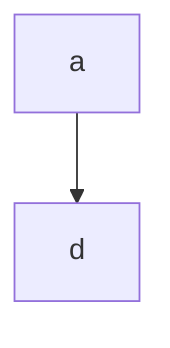
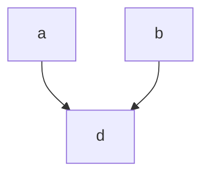
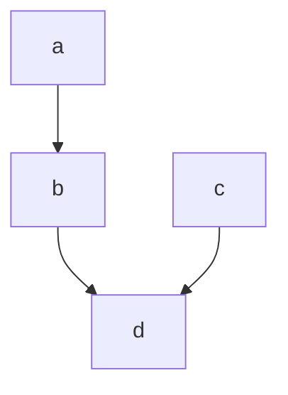
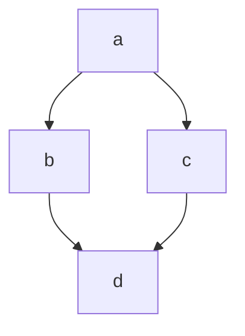
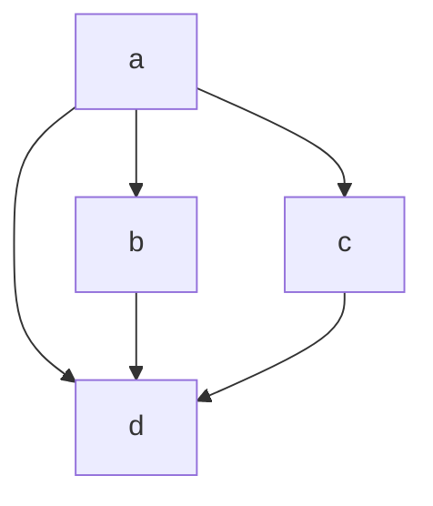

# @crikey/stores-base

Core package used for the implementation of various [Svelte](https://svelte.dev/) compatible stores.

## Installation

```bash
# pnpm
$ pnpm add @crikey/stores-base

# npm
$ npm add @crikey/stores-base

# yarn
$ yarn add @crikey/stores-base
```

## Usage

## Differences with Svelte stores 

### Premature evaluation
Ensuring a derived store value is evaluated against up-to-date inputs is non-trivial.

From the below examples, svelte and @crikey are comparable except for (e) where svelte stores may erroneously calculate
a derived value based off of atrophied inputs.

Some examples:

_a) Simple single dependency_
* As soon as `a` changes, `d` is recalculated.


_b) Simple dual dependency_
* As soon as `a` or `b` changes, `d` is recalculated.


_c) Simple chained dependency_
* As soon as `a` changes, `b` is recalculated.
* As soon as `b` or `c` changes, `d` is recalculated.


_d) Diamond dependency_
* As soon as `a` changes, `b` and `c` are recalculated. 
* As soon as `b` or `c` changes, `d` is recalculated.



e) Diamond+ dependency
* As soon as `a` changes, `b` and `c` are recalculated.
* As soon as `b` or `c` changes, `d` is recalculated.

_svelte_:
A change to `a` may result in `d` being recalculated multiple times, sometimes using partially atrophied data from its 
dependencies.

_@crikey_:
A change to `a` will at most result in `d` being recalculated once, after all its dependencies have been resolved. 

